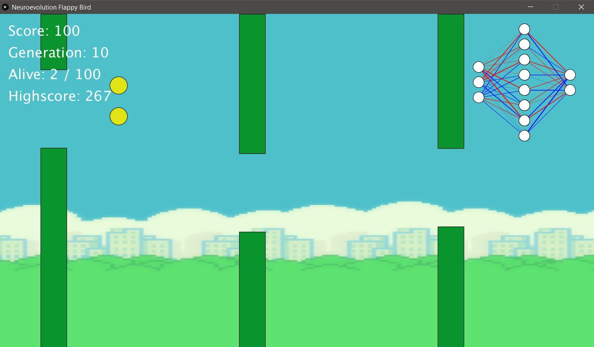

# neuroevolution-flappy-bird
Using artificial neural network and genetic algorithm to train bot to play Flappy Bird.

## Neural network architecture

Neural network used is simple neural network with 3 inputs, 8 hidden neurons and 2 output neurons. 
Inputs to the network are:
  * Horizontal distance from the bird to the center of the closest pipe
  * Vertical distance to the top of the gap of the closest pipe
  * Vertical distance to the bottom of the gap of the closest pipe
  
Net has two outputs, bird will flap if the first output is greater than the second

## Genetic algorithm options

 * Population size: 100
 * Elitism: 0.2
 * Random behaviour: 0.2
 * Mutation rate: 0.1
 * Mutation standard deviation: 0.5
 * Number of children: 1
 
### Neural network encoding

Each neural network flattens to one-dimensional array of weights. First elements of the array are the weights connecting input layer with the first hidden layer and so on.

### Crossover

Child firstly takes all the weights from one of its parents. For every weight of the child's network, there is a 50% chance for it to be replaced with the corresponding weight of the second parent's network.

### Selection

Selection algorithm used is Pool selection.

## Neural network visualization

 * Weight of the line indicates how strong the net weight is
 * Blue means weight is positive
 * Red means weight is negative

## Graphics library

Java Processing 3.5.4: https://processing.org/

## References

 * https://www.youtube.com/watch?v=aeWmdojEJf0
 * https://www.youtube.com/watch?v=WSW-5m8lRMs
 * https://towardsdatascience.com/neural-network-plays-flappy-bird-e585b1e49d97

## License

This program is free. 
You can redistribute it and/or change it under the terms of **GNU General Public License version 3.0** (GPLv3).  
You can find a copy of the license in the repository.
